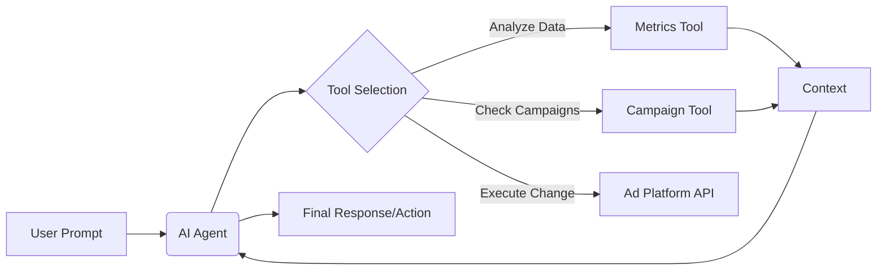

# Ryze AI - Autonomous Advertising Management Platform


**Ryze AI** is an advanced, autonomous advertising platform that goes beyond simple suggestions. It leverages Generative AI (Google Gemini) to analyze, predict, and **execute** optimizations across multiple advertising channels (Google Ads, Meta, LinkedIn, etc.) through a unified Natural Language Interface.

---

## 📋 Table of Contents

- [Features](#-features)
- [How It Works](#-how-it-works-workflows)
- [Tech Stack](#-tech-stack)
- [Project Structure](#-project-structure)
- [Getting Started](#-getting-started)
- [Technical Core](#-technical-core)
    - [Response Format](#standard-response-format)
    - [Error Handling](#error-codes--handling)
    - [Security & Authentication](#security--authentication)
- [API Reference](#-api-reference)
    - [Authentication](#authentication)
    - [Users](#users)
    - [Workspaces](#workspaces)
    - [Ad Accounts](#ad-accounts)
    - [Campaigns](#campaigns)
    - [AI Chat](#ai-chat)
    - [Automation](#automation)
    - [AI Recommendations](#ai-recommendations)
    - [Creative Lab](#creative-lab)
    - [Reports](#reports)
- [Contributing](#-contributing)
- [License](#-license)

---

## 🚀 Features

### 🧠 Core Intelligence
-   **Natural Language Command Center**: Talk to your ad data. "Decrease budget on underperforming campaigns by 10%" or "Why did my ROAS drop yesterday?"
-   **Autonomous Execution**: Ryze doesn't just tell you what to do; it can do it for you (with your permission settings).
-   **Predictive Analytics**: Forecasts performance dips 24-72 hours in advance using historical trend analysis.

### ⚡ Automation & Control
-   **Rule Engine**: Set "If This Then That" rules for your ads (e.g., "If CPA > $50, pause ad").
-   **Guardrails**: Safety limits (Max Daily Spend, prohibited actions) to ensure AI never goes rogue.
-   **Multi-Platform Support**: Unified dashboard for Google Ads, Meta, LinkedIn, Amazon, TikTok, Reddit, and Twitter.

### 🎨 Creative & Strategy
-   **Creative Lab**: AI-generated ad copy and image variations based on top-performing assets.
-   **Competitor Intelligence**: Track competitor ads, landing pages, and market positioning.
-   **Audience Journeys**: Multi-touch attribution tracking to understand the full customer path.

---

## 🔄 How It Works (Workflows)

### 1. The AI Command Loop
This is the heart of Ryze AI, transforming user intent into database actions.



### 2. Automation Rule Execution
How the system monitors and acts on your behalf 24/7.

1.  **Trigger**: System monitors metrics (e.g., ROAS drops below 2.0).
2.  **Evaluation**: Checks against defined Rules and **Guardrails** (e.g., "Don't pause if spend < $100").
3.  **Action**:
    *   *Auto Mode*: Executes the change immediately.
    *   *Approval Mode*: Creates an alert for the user to approve.
4.  **Notification**: Logs the event and notifies the user via Dashboard/Email.

---

## 💻 Tech Stack

This project is built as a **Monorepo** using **Bun Workspaces**.

| Component | Technology | Description |
| :--- | :--- | :--- |
| **Runtime** | **Bun** | Ultra-fast JavaScript runtime & package manager |
| **Frontend** | **React 18** + **Vite** | Fast, interactive UI with Tailwind CSS & Shadcn/UI |
| **Backend** | **Node.js** + **Express** | Functional, module-based REST API |
| **Database** | **PostgreSQL** | Relational data storage |
| **ORM** | **Prisma** | Type-safe database client & migrations |
| **AI** | **Google Gemini** | LLM powering the chat & insights (via LangChain) |
| **DevOps** | **Docker** | Containerization for easy deployment |

---

## 📂 Project Structure

```bash
ryze-ai/
├── apps/
│   ├── api/          # Backend Server (Express + Prisma)
│   │   ├── src/modules/    # Feature-based architecture (Auth, Chat, etc.)
│   │   └── prisma/         # Database Schema
│   └── web/          # Frontend App (React + Vite)
├── packages/
│   └── shared/       # Shared Types, Interfaces & Zod Schemas
└── package.json      # Root configuration & Workspaces
```

---

---

## 🛠 Technical Core

### Standard Response Format
All API responses follow a consistent JSON structure to simplify frontend integration:

```json
{
  "success": true,
  "data": { ... },
  "meta": {
    "page": 1,
    "limit": 20,
    "total": 100,
    "totalPages": 5
  }
}
```

### Error Codes & Handling
Ryze AI uses semantic error codes. When an error occurs, the `success` field is `false`, and an `error` object is provided.

| Code | Status | Description |
| :--- | :--- | :--- |
| `VALIDATION_ERROR` | 400 | Data failed Zod schema validation. |
| `INVALID_TOKEN` | 401 | JWT is missing, malformed, or invalid. |
| `TOKEN_EXPIRED` | 401 | Access token has expired. Use refresh token. |
| `FORBIDDEN` | 403 | Authenticated, but lacking permissions (RBAC). |
| `NOT_FOUND` | 404 | Resource with specific ID does not exist. |
| `DUPLICATE_ENTRY` | 409 | Unique constraint violation (e.g., Email taken). |
| `INTERNAL_ERROR` | 500 | Unhandled server exception. |

**Example Error Response**:
```json
{
  "success": false,
  "error": {
    "code": "VALIDATION_ERROR",
    "message": "Validation failed",
    "details": [
      { "field": "email", "message": "Invalid email address" }
    ]
  }
}
```

### Security & Authentication
Authentication is handled via **JWT (JSON Web Tokens)** with a silent-rotation refresh strategy.
1. **Header**: Include the access token in the `Authorization` header.
   `Authorization: Bearer <your_access_token>`
2. **Access Token**: Short-lived (15 min).
3. **Refresh Token**: Long-lived (7 days), stored in a secure cookie or local storage, and validated against the database.

---

## 📚 API Reference

All API routes are prefixed with `/api/v1`.

### Authentication
`Module: @modules/auth`

The Authentication module provides the secure "Front Door" to the Ryze AI ecosystem. It handles user identity, permission scopes, and session persistence.

*   **What it does**: Manages user registration, secure login, and session lifecycle through JWT token management.
*   **How it works**: Uses `bcrypt` for one-way password hashing and `jsonwebtoken` for stateless, signed session tokens. It implements a **Dual-Token Strategy** (Access + Refresh) to balance security with user convenience.
*   **Importance**: Critical for multi-tenant data isolation and preventing unauthorized access to sensitive ad account credentials (OAuth tokens).

| Method | Endpoint | Description |
| :--- | :--- | :--- |
| `POST` | `/auth/register` | Create a new account & primary workspace. |
| `POST` | `/auth/login` | Login and receive JWT tokens. |
| `POST` | `/auth/refresh` | Exchange refresh token for new access token. |
| `POST` | `/auth/logout` | Invalidate current refresh token. |
| `POST` | `/auth/logout-all` | Purge all sessions for the user. |
| `GET` | `/auth/me` | Fetch current session data. |

#### **Endpoint Deep-Dive**

##### **`POST /auth/register`**
*   **Description**: Registers a new user. It hashes the password using `bcrypt` (Salt: 12) and auto-generates a workspace named `{User}'s Workspace`.
*   **Body (JSON)**:
    ```json
    {
      "email": "dev@ryze.ai",
      "password": "SecurePassword123!",
      "name": "Alex Dev"
    }
    ```
*   **Success (201)**:
    ```json
    {
      "success": true,
      "data": {
        "user": { "id": "uuid", "email": "dev@ryze.ai", "name": "Alex Dev" },
        "tokens": { "accessToken": "...", "refreshToken": "..." }
      }
    }
    ```
*   **Example (cURL)**:
    ```bash
    curl -X POST http://localhost:3001/api/v1/auth/register \
         -H "Content-Type: application/json" \
         -d '{"email":"test@test.com", "password":"Password1!", "name":"Test"}'
    ```

##### **`POST /auth/login`**
*   **Description**: Validates credentials and returns session tokens.
*   **Success (200)**: returns `user` and `tokens` object.
*   **Errors**: `401 INVALID_CREDENTIALS` if email or password mismatch.

---

### Users
`Module: @modules/users`

The Users module focuses on the individual's identity and preferences within the platform.

*   **What it does**: Handles the retrieval and management of personal profile data, including display names and avatars.
*   **How it works**: Interfaces directly with the Prisma `User` model, allowing for specific metadata updates without affecting workspace-level permissions.
*   **Importance**: Provides the personalization layer of the platform, ensuring clear identification of which user performed specific AI chat commands or automation approvals.

| Method | Endpoint | Description |
| :--- | :--- | :--- |
| `GET` | `/users/profile` | Get detailed user profile. |
| `PATCH` | `/users/profile` | Update profile metadata. |

#### **Endpoint Deep-Dive**

##### **`PATCH /users/profile`**
*   **Auth**: Required (Bearer)
*   **Body (JSON)**:
    ```json
    {
      "name": "New Name",
      "avatar": "https://cdn.ryze.ai/avatars/user1.jpg"
    }
    ```
*   **Logic**: Performs a targeted Prisma update. Only sent fields are modified.

---

### Workspaces
`Module: @modules/workspaces`

Workspaces provide the foundational isolation layer of Ryze AI, acting as independent business units.

*   **What it does**: Manages the creation, naming, and membership of organizational containers. Every campaign, chat session, and ad account belongs to exactly one workspace.
*   **How it works**: Implements a **Many-to-Many relationship** between Users and Workspaces through the `WorkspaceMember` table, supporting granular Role-Based Access Control (RBAC).
*   **Importance**: Essential for agency-style usage where one user might manage multiple clients. It guarantees that data from "Client A" never leaks into "Client B's" AI models or reports.

| Method | Endpoint | Description |
| :--- | :--- | :--- |
| `GET` | `/workspaces` | List all workspaces the user is a member of. |
| `POST` | `/workspaces` | Create a new workspace. |
| `GET` | `/workspaces/:id` | Get details of a specific workspace. |
| `PATCH` | `/workspaces/:id` | Update workspace settings. |
| `DELETE` | `/workspaces/:id` | Delete a workspace (Owner only). |
| `POST` | `/workspaces/:id/members` | Invite a user to the workspace. |
| `DELETE` | `/workspaces/:id/members/:uid` | Remove a member from the workspace. |

#### **Endpoint Deep-Dive**

##### **`POST /workspaces`**
*   **Description**: Creates a new business isolation unit.
*   **Body (JSON)**:
    ```json
    { "name": "Marketing Team B" }
    ```
*   **Response (201)**: Returns the workspace object with a unique `id` and `slug`.
*   **Logic**: Automatically assigns the current user as `OWNER`.

##### **`POST /workspaces/:id/members`**
*   **Permissions**: `OWNER` or `ADMIN` only.
*   **Body (JSON)**:
    ```json
    {
      "email": "teammate@example.com",
      "role": "ADMIN" // Options: ADMIN, MEMBER, VIEWER
    }
    ```
*   **Errors**: `404 USER_NOT_FOUND` if the email isn't registered on Ryze AI.

---

### Ad Accounts
`Module: @modules/ad-accounts`

The Ad Accounts module manages the bridge between Ryze AI and external advertising giants like Google and Meta.

*   **What it does**: Handles the OAuth2 handshakes, token storage, and lifecycle (syncing/disconnecting) of third-party platform connections.
*   **How it works**: Uses a **Secure Callback Pattern** where platforms redirect to Ryze with a authorization code. This code is exchanged for permanent `refresh_tokens`, which are then encrypted and stored in PostgreSQL.
*   **Importance**: This is the data heartbeat of the platform. Without these connections, the AI would be blind and unable to execute optimizations or fetch live metrics.

| Method | Endpoint | Description |
| :--- | :--- | :--- |
| `GET` | `/accounts` | List all platform connections in workspace. |
| `POST` | `/accounts/connect` | Get OAuth authorize URL for a platform. |
| `GET` | `/accounts/:id` | Fetch account sync status. |
| `DELETE` | `/accounts/:id` | Disconnect platform (Revoke tokens). |
| `POST` | `/accounts/:id/sync` | Trigger manual data synchronization. |

#### **Endpoint Deep-Dive**

##### **`POST /accounts/connect`**
*   **Description**: Generates the redirect URL for platform authorization.
*   **Body (JSON)**:
    ```json
    { "platform": "GOOGLE_ADS" }
    ```
*   **Response**: `{ "success": true, "data": { "url": "https://accounts.google.com/o/oauth2/..." } }`

##### **`POST /accounts/:id/sync`**
*   **Logic**: Initiates a background job (Queue) to pull Campaigns, AdGroups, and Metrics from the respective platform's Graph/REST API.

---

### Campaigns & Metrics
`Module: @modules/campaigns`

This module acts as the numerical brain, aggregating diverse and messy data into clean, actionable intelligence.

*   **What it does**: Normalizes heterogeneous data from multiple platforms into a unified schema for Campaigns, AdGroups, and daily performance Metrics.
*   **How it works**: Implements a **Data Normalization Layer** in the Prisma schema, mapping varied platform terminologies (e.g., Google's "Conversions" vs Meta's "Results") into a standardized `AdMetric` table.
*   **Importance**: Provides the high-fidelity historical data required for the AI to detect trends and calculate growth-critical KPIs like accurate ROAS and CPA across different channels.

| Method | Endpoint | Description |
| :--- | :--- | :--- |
| `GET` | `/campaigns` | List campaigns with summary metrics. |
| `GET` | `/campaigns/:id` | Details on status, budget, and config. |
| `GET` | `/campaigns/:id/metrics` | Granular time-series performance data. |

#### **Endpoint Deep-Dive**

##### **`GET /campaigns/:id/metrics`**
*   **Description**: Retrieves historical performance metrics.
*   **Query Parameters**:
    | Parameter | Type | Required | Default | Description |
    | :--- | :--- | :--- | :--- | :--- |
    | `startDate` | ISO8601 | No | Today-30d | Start of report range. |
    | `endDate` | ISO8601 | No | Today | End of report range. |
    | `groupBy` | String | No | `day` | Grouping: `day`, `week`, `month`. |

*   **Success Response**:
    ```json
    {
      "success": true,
      "data": [
        {
          "date": "2024-01-20",
          "spend": 150.50,
          "impressions": 12000,
          "clicks": 450,
          "conversions": 12,
          "roas": 3.4
        }
      ]
    }
    ```

---

### AI Chat
`Module: @modules/ai-chat`

The AI Chat is the primary "Command and Control" interface, transforming human intent into complex database and API operations.

*   **What it does**: Provides a natural language interface for multi-platform ad management, reporting, and reactive optimization.
*   **How it works**: Powered by **Google Gemini 1.5** via a **ReAct (Reason + Act) Agent**. The agent has access to a set of internal "Tools" (TypeScript functions) that can query metrics, list campaigns, or execute budget changes.
*   **Importance**: Ryze AI's core differentiator. It eliminates the need for manual CSV exports and complex dashboard navigation by allowing users to manage global ad spend through simple conversation.

| Method | Endpoint | Description |
| :--- | :--- | :--- |
| `POST` | `/chat/workspaces/:wid/sessions` | Create a new chat session. |
| `GET` | `/chat/workspaces/:wid/sessions` | List chat sessions. |
| `GET` | `/chat/sessions/:sid` | Get chat history for a session. |
| `DELETE` | `/chat/sessions/:sid` | Delete a chat session. |
| `POST` | `/chat/workspaces/:wid/message` | Send a message to the AI. |
| `POST` | `/chat/workspaces/:wid/message/stream` | Send a message and get a streaming response. |

#### **Endpoint Deep-Dive**

##### **`POST /chat/workspaces/:wid/message`**
*   **Description**: Processes a natural language command using Google Gemini.
*   **Body (JSON)**:
    ```json
    {
      "message": "Which LinkedIn campaigns have a ROAS below 1.5?",
      "sessionId": "optional-uuid"
    }
    ```
*   **Success Response**:
    ```json
    {
      "success": true,
      "data": {
        "content": "I found 3 campaigns with ROAS below 1.5...",
        "sessionId": "uuid",
        "toolsUsed": ["get_campaigns", "get_performance_metrics"]
      }
    }
    ```

##### **`POST /chat/workspaces/:wid/message/stream`**
*   **Protocol**: **Server-Sent Events (SSE)**.
*   **Behavior**: Instead of a single JSON object, the server sends multiple data chunks as the AI "types" the response.
*   **Event Format**:
    ```text
    data: {"chunk": "I "}
    data: {"chunk": "found "}
    data: {"chunk": "3 "}
    ...
    data: {"done": true, "sessionId": "uuid"}
    ```

##### **`GET /chat/sessions/:sid`**
*   **Description**: Retrieves historical context for a conversation.
*   **Response (JSON)**: Returns an array of message objects:
    ```json
    {
      "id": "msg_123",
      "role": "USER",
      "content": "Reduce budget on...",
      "createdAt": "2024-01-25T12:00:00Z"
    }
    ```

---

### Automation
`Module: @modules/automation`

Ryze AI's Automation module provides the "Active Safety Net" for your ad spend, operating 24/7 without human intervention.

*   **What it does**: Allows users to define programmable logic (Triggers + Actions) that monitors campaign performance and executes changes based on predefined thresholds.
*   **How it works**: Uses an **Hourly Observer Pattern** where a background cron job evaluates every active rule against the latest metrics in PostgreSQL. If a trigger is met, it initiates an `AutomationExecution` flow.
*   **Importance**: Vital for cost control and risk mitigation. It ensures that budgets are never wasted on underperforming ads during weekends or off-hours.

| Method | Endpoint | Description |
| :--- | :--- | :--- |
| `GET` | `/automations/rules` | List automation rules. |
| `POST` | `/automations/rules` | Create a new automation rule. |
| `GET` | `/automations/rules/:id` | Get rule details. |
| `PATCH` | `/automations/rules/:id` | Update a rule. |
| `DELETE` | `/automations/rules/:id` | Delete a rule. |
| `POST` | `/automations/rules/:id/toggle` | Enable/Disable a rule. |
| `GET` | `/automations/logs` | View execution logs of automation rules. |

#### **Endpoint Deep-Dive**

##### **`POST /automations/rules`**
*   **Description**: Configures an autonomous guardrail.
*   **Trigger Types**: `ROAS_BELOW_THRESHOLD`, `CPA_ABOVE_THRESHOLD`, `SPEND_EXCEEDS_BUDGET`.
*   **Body (JSON)**:
    ```json
    {
      "name": "ROAS Guardrail",
      "triggerType": "ROAS_BELOW_THRESHOLD",
      "triggerConfig": { "threshold": 2.0, "lookbackDays": 7 },
      "actionType": "PAUSE_CAMPAIGN",
      "executionMode": "APPROVAL" // Options: AUTO, APPROVAL, NOTIFY
    }
    ```
*   **Logic**: The system background-evaluates these rules every hour and creates `AutomationExecution` records.

##### **`GET /automations/logs`**
*   **Response**: Returns execution history, showing which campaigns were affected and why.

---

### AI Recommendations
`Module: @modules/ai-recommendations`

This module serves as the proactive advisory arm of the platform, finding growth opportunities that might go unnoticed.

*   **What it does**: Analyzes historical metrics to produce specific, actionable advice (e.g., "Increase bid on Keyword X").
*   **How it works**: Leverages specialized **LLM Prompts** that are fed with workspace performance context. These recommendations are stored in a `PENDING` state until a user interacts with them.
*   **Importance**: Provides the "Consultant-in-a-Box" experience. It empowers non-experts to make sophisticated, data-driven decisions that typically require a professional media buyer.

| Method | Endpoint | Description |
| :--- | :--- | :--- |
| `GET` | `/recommendations` | List pending recommendations. |
| `POST` | `/recommendations/generate` | Force generate new recommendations. |
| `POST` | `/recommendations/:id/apply` | Apply a recommendation automatically. |
| `POST` | `/recommendations/:id/dismiss` | Dismiss a recommendation. |

#### **Endpoint Deep-Dive**

##### **`POST /recommendations/:id/apply`**
*   **Description**: Executes an AI-generated optimization.
*   **Security**: Requires the user to have `ADMIN` role in the workspace.
*   **Operation**: Triggers an asynchronous call to the respective platform API (e.g., Google Ads `CampaignService.mutate`).

---

### Creative Lab
`Module: @modules/ai-creative`

The Creative Lab is the generative powerhouse of the platform, solving the "Blank Canvas" problem for ad creation.

*   **What it does**: Generates localized, platform-optimized ad copy and high-quality visual assets from a simple product description.
*   **How it works**: Orchestrates calls to **Google Gemini** (for copy) and **DALL-E/Imagen** (for visuals), grounding the generation in proven high-performing templates.
*   **Importance**: Drastically reduces the time and cost of creative production. It allows for Rapid Creative Testing (RCT) by generating dozens of variations in seconds.

| Method | Endpoint | Description |
| :--- | :--- | :--- |
| `GET` | `/creative` | List generated creatives. |
| `POST` | `/creative/generate` | Generate full creative packages. |
| `POST` | `/creative/generate/copy` | Generate ad copy only. |
| `POST` | `/creative/generate/images` | Generate image variations. |
| `GET` | `/creative/templates` | List creative templates. |

#### **Endpoint Deep-Dive**

##### **`POST /creative/generate`**
*   **Description**: Generates a full ad package.
*   **Body (JSON)**:
    ```json
    {
      "productName": "Ryze Pro",
      "usp": ["Autonomous ROAS optimization", "Gemini 1.5 Powered"],
      "platform": "FACEBOOK"
    }
    ```
*   **Output**: Returns URLs for generated image assets and specific localized ad copy strings.

---

### Reports
`Module: @modules/reports`

Reporting is the accountability layer of Ryze AI, providing structured transparency into platform performance and AI actions.

*   **What it does**: Generates scheduled or on-demand documents (PDF/CSV) that summarize cross-platform metrics and automation history.
*   **How it works**: Uses a **Headless Transformation Engine** to pull raw JSON data from the database and render it into professional, stakeholder-ready formats.
*   **Importance**: Provides the "Paper Trail" necessary for internal audits and client reporting, ensuring that the AI's impact is always quantifiable and verifiable.

| Method | Endpoint | Description |
| :--- | :--- | :--- |
| `GET` | `/reports` | List saved reports. |
| `POST` | `/reports` | Create a new report configuration. |
| `POST` | `/reports/:id/generate` | Generate a report instance. |
| `GET` | `/reports/:id/download` | Download report (PDF/CSV). |
| `POST` | `/reports/:id/schedule` | Schedule recurring reports. |

#### **Endpoint Deep-Dive**

##### **`GET /reports/:id/download`**
*   **Description**: Exports performance data.
*   **Query Parameters**:
    | Parameter | Type | Options |
    | :--- | :--- | :--- |
    | `format` | String | `pdf`, `csv`, `json` |

*   **Logic**: Fetches data from the `Report` table's `content` JSON field and converts it to the requested document format using `jspdf` or `fast-csv`.

---

## 🤝 Contributing

1.  Fork the repository.
2.  Create your feature branch: `git checkout -b feature/amazing-feature`
3.  Commit your changes: `git commit -m 'Add some amazing feature'`
4.  Push to the branch: `git push origin feature/amazing-feature`
5.  Open a Pull Request.

---

## 📄 License

This project is licensed under the MIT License - see the [LICENSE](LICENSE) file for details.